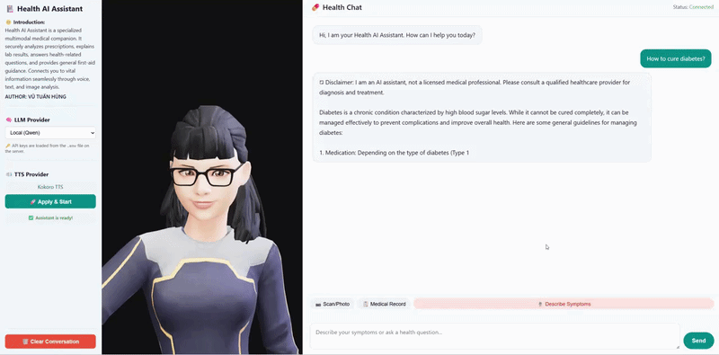

<div align="center">
  <h1>🤖 MMVA</h1>
  <h3>Medical Multimodal Voice Assistant</h3>
  <p>A production-ready, multi-modal AI assistant supporting <b>text, voice, and image</b> inputs with <b>RAG</b>, <b>tool calling</b>, <b>streaming TTS</b>, and support for multiple LLM backends.</p>
  
  [](https://www.python.org)
  [](https://fastapi.tiangolo.com)
  [](https://www.docker.com/)
  [](LICENSE)
</div>

---

<div align="center">
  
</div>

---

## 📑 Table of Contents

- [✨ Key Features](#-key-features)
- [🛠️ Technology Stack](#️-technology-stack)
- [🚀 Quickstart Guide](#-quickstart-guide)
  - [Option A: Local Installation (No Docker)](#option-a-local-installation-no-docker)
  - [Option B: Docker Deployment (Recommended) 🐳](#option-b-docker-deployment-recommended-)
- [🎮 Usage Guide](#-usage-guide)
- [🔧 Useful Docker Commands](#-useful-docker-commands)

---

## ✨ Key Features

- **🧠 Multi-LLM Support:** Compatible with DeepSeek, OpenAI GPT-4, Anthropic Claude, Google Gemini, and Local Models (Qwen via llama.cpp).
- **📄 Advanced RAG Pipeline:** Upload documents (PDF, DOCX, TXT, CSV, MD) → auto-indexed via ChromaDB + HuggingFace Embeddings for highly accurate semantic retrieval.
- **🎙️ Voice I/O:** Real-time speech-to-text using Whisper (via `faster-whisper`) and neural text-to-speech via Kokoro.
- **🖼️ Vision Capabilities:** Multi-modal image understanding (screenshots, webcam captures, file uploads).
- **🔧 Tool Calling Integration:** Capable of clipboard extraction and extensible for custom external tools.
- **🔀 Smart Intent Router:** Automatically routes user queries to the RAG pipeline or general LLM based on context.
- **💬 Interactive Web UI:** Custom HTML/JS interface featuring a real-time **Lip-sync 3D Avatar** and live WebSocket streaming.

---

## 🛠️ Technology Stack

| Category | Technologies Used |
| :--- | :--- |
| **Backend Framework** | FastAPI, WebSockets, Uvicorn |
| **LLM Orchestration** | Custom `ToolLoop`, `ConversationContext` with conversational memory |
| **Retrieval-Augmented Gen.** | LangChain, **ChromaDB**, `sentence-transformers/all-MiniLM-L6-v2` |
| **Speech-to-Text (STT)** | OpenAI Whisper (`faster-whisper`) |
| **Text-to-Speech (TTS)** | Kokoro (Neural streaming TTS) |
| **Frontend UI** | HTML5, CSS3, Vanilla JS, `talkinghead` (for 3D Avatar) |

---

## 🚀 Quickstart Guide

### Option A: Local Installation (No Docker)

**1. Clone & Install Dependencies**
```bash
git clone https://github.com/vutuanhungkkk/Mmva-me.git
cd Mmva-me
pip install -r requirements.txt
```

**2. Start the Servers**
You can start both the backend and frontend simultaneously using the provided startup script:
```bash
# On Linux/macOS
./start.sh

# Or start manually:
# Backend (Terminal 1)
cd backend && python main.py
# Frontend (Terminal 2)
python -m http.server 8080 -d frontend
```

**3. Access the UI**
Open your browser and navigate to: `http://localhost:8080/`

---

### Option B: Docker Deployment (Recommended) 🐳

> ✅ **Zero dependency headaches:** Everything is pre-packaged and optimized for NVIDIA GPUs.

#### System Requirements
- **OS:** Windows 10/11 (WSL2) or Ubuntu 20.04+
- **GPU:** NVIDIA GPU with at least 6GB VRAM (CUDA 12.6+ supported)
- **RAM:** ≥ 16GB System Memory
- **Docker:** Docker Desktop or Docker Engine + NVIDIA Container Toolkit

#### Configuration & Launch

**1. Configure Environment Variables**
```bash
cp .env.example .env
```
Edit the `.env` file to include your preferred API keys (OpenAI, Anthropic, DeepSeek, Google, etc.).

**2. Add Local Models (Optional)**
If using local models, download and place your `.gguf` files in the `models/` directory:
- **Qwen Model:** [Download here](https://huggingface.co/mradermacher/Qwen2.5-7B-Medicine-GGUF?show_file_info=Qwen2.5-7B-Medicine.IQ4_XS.gguf)
- **Other Models:** [Download here](https://drive.google.com/drive/folders/1WjCkTfNKyWipE8WEIe3ESDxnHyPa1stB?usp=sharing)

```text
models/
└── your-local-model.gguf
```

**3. Build and Run**
```bash
docker compose up --build -d
```

**4. Access the UI**
Open your browser and navigate to: `http://localhost:8080/`

---

## 🎮 Usage Guide

- **💬 Text Chat:** Type your message and press **Send**. Select your preferred LLM provider directly from the sidebar.
- **🎙️ Voice Input:** Click **🎙️ Click to Speak**, speak naturally, then click **⏹️ Click to Stop** for automatic transcription and response.
- **🖼️ Image Analysis:** Upload an image (JPG, PNG, WebP) via the attachment button, add an optional prompt, and send. The vision model will analyze and respond.
- **📄 RAG Document Q&A:** Upload any supported document. The assistant will index it and restrict its answers to the document's context. Click the **✕** on the document chip to clear the context.
- **👤 3D Avatar Interaction:** Watch the avatar respond with real-time lip-syncing based on the generated TTS audio stream.

---

## 🔧 Useful Docker Commands

```bash
# View application logs in real-time
docker compose logs -f

# Stop all services safely
docker compose down

# Rebuild the image after modifying source code or dependencies
docker compose build --no-cache && docker compose up -d
```

---
<div align="center">
  <i>Built with ❤️ by Vu Tuan Hung</i>
</div>
